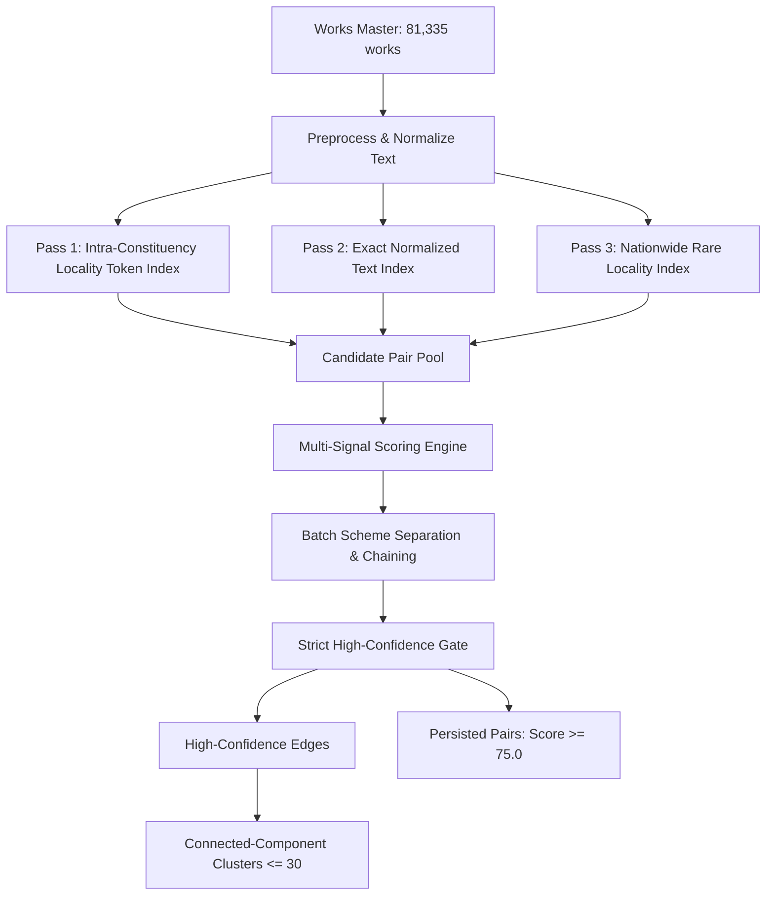

# MPLADS Sentinel 2.0 — Duplicate Work Detection v1

## 1. Executive Summary

As part of **MPLADS Sentinel 2.0**, the **Duplicate Work Detection** capability provides automated, explainable, and multi-signal identification of potential duplicate work entries or substantially overlapping scopes of work.

Public works data often experiences data entry anomalies, overlapping administrative submissions, split work packages, or accidental double sanctions. Rather than relying on simple string matching, Sentinel 2.0 combines:
1. **Multi-Pass Token Blocking**: Scales across all 81,335 works without quadratic computational overhead.
2. **Multi-Signal Bounded Scoring**: Combines character trigram similarity, locality token overlap, financial sanction amounts, approval calendar dates, and consecutive serial identifiers into an explainable score between `0.0` and `100.0`.
3. **Strict High-Confidence Gating**: Text similarity alone can **never** produce a high-confidence finding unless financial, temporal, and numeric signals strictly align.
4. **Batch Scheme Separation**: Distinguishes intentional distributed programs (e.g., hundreds of solar lights, handpumps, or school benches) from individual duplicate work candidates using linear representative chaining ($O(N)$ instead of $O(N^2)$).
5. **Transitive Clustering Safeguards**: Restricts cluster formation to high-confidence edges with cluster size limits ($\le 30$) to prevent chained drift.
6. **Strictly Neutral Language**: Every explanation is non-accusatory and concludes with the mandatory standard review disclaimer.

---

## 2. Guiding Principles & Neutral Terminology

Duplicate detection in public infrastructure monitoring serves as an audit and review aid for project officers, finance controllers, and citizens. It is **not** an automated judge or court.

### 2.1 Approved Terminology
- **Potential Duplicate**
- **Possible Duplicate**
- **Duplicate Review Candidate**
- **Similar Work**
- **Duplicate Work Risk**
- **Batch / Programmatic Scheme**

### 2.2 Prohibited Accusatory Vocabulary
The system strictly prohibits words that imply guilt or malfeasance in classification labels or machine-generated explanations:
- *Fraud*, *Fraudulent*, *Illegal*, *Guilty*, *Crime*, *Criminal*, *Scam*, *Wrongdoing*

### 2.3 Mandatory Disclaimer
All explanations generated by the system conclude with:
> *"This indicates potential duplicate entry or overlapping scope that may warrant verification and does not establish wrongdoing."*

---

## 3. Empirical Data Investigation

Analysis of `data/processed/works_master.csv` (81,335 total works) revealed key operational patterns:

1. **Exact Duplicate Descriptions**: Over 38,000 works share an exact description with at least one other work. The vast majority represent legitimate distributed programmatic investments:
   - High-volume items: Solar street lights, LED fixtures, submersible handpumps, Anganwadi repair, open gym equipment, high-mast towers.
   - Example: Certain parliamentary constituencies contain 50 to 300+ identical entries like `"Installation of Solar Street Light in Constituency"`.
2. **Consecutive Work ID Serials**: Accidental re-entries or split work approvals strongly correlate with sequential Work ID numbers (e.g., ending in `.../151021` and `.../151022`).
3. **Locality Distinction via Numbers**: Many descriptions differ by only a numeral (e.g., `"Construction of CC Road in Ward 4"` vs `"Construction of CC Road in Ward 7"`). Treating these as duplicates without numeral conflict detection creates massive false positives.

---

## 4. Multi-Pass Candidate Blocking Architecture

Comparing all $81,335$ works pairwise requires $\approx 3.3 \times 10^9$ evaluations, which is computationally prohibitive and generates immense noise. Sentinel 2.0 uses a 3-pass blocking strategy that scales in under 30 seconds:



### Pass 1: Intra-Constituency Locality Token Inverted Index
- **Scope**: Within each parliamentary constituency.
- **Keys**: Distinctive core tokens (filtered for common stopwords, numerals, and generic domain words like *construction*, *installation*, *road*, *drain*, *light*, *hall*, *gram*, *panchayat*).
- **Pruning**: Keys matching more than 40 works within a single constituency are skipped to prevent quadratic pair explosions on ubiquitous regional terms.

### Pass 2: Exact Normalized Text Inverted Index
- **Scope**: Nationwide.
- **Keys**: Full normalized description string.
- **Handling**: Captures exact identical entries across constituencies or within IDA jurisdictions. If a template has $N > 8$ occurrences in a constituency or $N > 20$ nationally, it is marked as a **Batch Template** and chained linearly ($O(N)$ pairs) rather than generating all $N(N-1)/2$ combinations.

### Pass 3: Nationwide Rare Locality Token Safety Net
- **Scope**: Nationwide.
- **Keys**: Highly specific proper nouns appearing in 2 to 6 works across the entire nation.
- **Purpose**: Catches cross-boundary duplicates where neighbouring constituencies or administrative units submit overlapping works for the same bridge, border road, or joint facility.

---

## 5. Multi-Signal Scoring Engine

The scoring model evaluates candidate pairs across textual, financial, temporal, administrative, and numeric dimensions:

| Signal Category | Condition | Points Awarded / Penalized |
|---|---|---|
| **Text Similarity** | Character Trigram Dice $\ge 0.95$ | $+45.0$ |
| | Character Trigram Dice $\ge 0.85$ | $+35.0$ |
| | Character Trigram Dice $\ge 0.75$ | $+25.0$ |
| | Character Trigram Dice $\ge 0.65$ | $+15.0$ |
| **Locality Token Overlap** | Core shared tokens $\ge 3$ | $+15.0$ |
| | Core shared tokens $\ge 1$ | $+10.0$ |
| **Sanction Amount Match** | Financial difference $\le 1.0\%$ | $+20.0$ |
| | Financial difference $\le 5.0\%$ | $+15.0$ |
| | Financial difference $\le 15.0\%$ | $+8.0$ |
| | Financial difference $> 50.0\%$ | $-25.0$ (Penalty) |
| **Sanction Date Alignment** | Date gap $\le 7$ days | $+15.0$ |
| | Date gap $\le 30$ days | $+10.0$ |
| | Date gap $\le 90$ days | $+5.0$ |
| | Date gap $> 365$ days | $-20.0$ (Penalty) |
| **Administrative Alignment**| Same Constituency | $+5.0$ |
| | Same Work Category | $+5.0$ |
| **Work ID Serial Correlation**| Consecutive Serials ($|S_a - S_b| = 1$) | $+3.0$ |
| **Numeral Conflicts** | Conflicting numerals (e.g. Ward 2 vs Ward 8) | $-35.0$ (Penalty) |
| **Proper Name Conflicts** | Distinct high-information proper nouns | $-40.0$ (Penalty) |

### Score Normalization Formula
Raw scores are strictly bounded to the $0.0–100.0$ interval:
$$\text{duplicate\_risk\_score} = \max(0.0, \min(100.0, \text{round}(\text{raw\_score}, 1)))$$

---

## 6. Strict High-Confidence Gating

Text similarity alone can **never** trigger a high-confidence finding. To be classified as a **High-Confidence Potential Duplicate**, a pair must satisfy ALL of the following criteria simultaneously:
1. `duplicate_risk_score >= 75.0`
2. `trigram_dice >= 0.85`
3. Locality overlap $\ge 2$ core tokens (or exact description with length $\ge 20$ chars)
4. Sanction amount difference $\le 5.0\%$
5. Sanction date gap $\le 90$ days OR consecutive serials ($|S_a - S_b| = 1$)
6. Zero conflicting numerals
7. Zero conflicting proper locality names

Pairs that fail any of these conditions are designated as **Medium-Confidence Potential Duplicate** or **Low-Confidence Review Candidate**.

---

## 7. Batch Scheme Separation & Linear Representative Chaining

Legitimate distributed projects (e.g., 200 solar street lights or 50 water purifiers) represent intentional policy executions rather than fraud or duplicate waste.

### 7.1 Separate Representation
Batch status is **not** handled by a simple score penalty. Instead, Sentinel 2.0 tracks explicit metadata:
- `is_batch_scheme`: `true` / `false` (independent boolean)
- `batch_frequency`: Integer frequency of the template
- `batch_scheme_reason`: Clear explanation (e.g., `"High-frequency work template in constituency (freq=84)"`)

### 7.2 Linear Chaining ($O(N)$ vs $O(N^2)$)
If a batch template has $N = 100$ works, generating all pairs would create $\frac{100 \times 99}{2} = 4,950$ pairs for that single scheme, overwhelming review queues. 

Sentinel 2.0 sorts the works by serial number and produces $N - 1$ sequential representative links:
$$W_1 \leftrightarrow W_2, \quad W_2 \leftrightarrow W_3, \quad \dots, \quad W_{N-1} \leftrightarrow W_N$$
This ensures:
- The entire batch scheme remains completely connected.
- Review queues are not inundated with redundant pairs.
- Total pair generation scales linearly.

---

## 8. Connected-Component Clustering Safeguards

Multi-work duplicate sets (e.g. triplicates or quadruplicates) are grouped into clusters using connected components.

### Safeguards Against Transitive Drift:
1. **High-Confidence Edges Only**: Only pairs passing the strict High-Confidence Gate can form cluster edges. Medium- and Low-confidence pairs are never allowed to bridge clusters.
2. **Cluster Size Ceiling**: If a cluster exceeds 30 works, it is capped and flagged to avoid transitive chains spanning across dissimilar projects.

---

## 9. Output Datasets & Schemas

### 9.1 `data/processed/potential_duplicate_pairs_v1.csv`
- Records: 56,504 rows (47.91 MB)
- High-Confidence pairs: 16,661
- Medium-Confidence pairs: 39,616
- Batch representative links: 227

| Field | Type | Description |
|---|---|---|
| `pair_id` | string | Unique pair ID (e.g. `DUP-151021-151022`) |
| `work_id_a` | string | First canonical Work ID |
| `work_id_b` | string | Second canonical Work ID |
| `cluster_id` | string | Cluster identifier (or blank) |
| `state` | string | State name |
| `constituency` | string | Constituency name |
| `mp_name` | string | MP name |
| `work_category` | string | Category of work |
| `description_a` | string | Official description of Work A |
| `description_b` | string | Official description of Work B |
| `sanction_amount_a` | float | Sanction amount for Work A (INR) |
| `sanction_amount_b` | float | Sanction amount for Work B (INR) |
| `amount_difference_pct` | float | Percentage difference in amounts |
| `sanction_date_a` | string | Approval date for Work A |
| `sanction_date_b` | string | Approval date for Work B |
| `date_gap_days` | int | Calendar gap in days |
| `consecutive_serials` | int | 1 if serials are sequential, else 0 |
| `duplicate_risk_score` | float | Bounded score 0.0 to 100.0 |
| `review_priority` | string | Priority label |
| `reasons` | string | Semicolon-delimited evidence reasons |
| `shared_entity_tokens` | string | Semicolon-delimited core shared tokens |
| `is_batch_scheme` | int | 1 if batch scheme, else 0 |
| `batch_frequency` | int | Template repetition count |
| `batch_scheme_reason` | string | Batch classification description |
| `explanation_text` | string | Explainable narrative ending with disclaimer |

### 9.2 `data/processed/potential_duplicate_clusters_v1.csv`
- Records: 3,232 clusters (436 KB)
- Works encompassed: 7,180 works

| Field | Type | Description |
|---|---|---|
| `cluster_id` | string | Unique cluster ID (e.g. `CLUST-00637`) |
| `work_count` | int | Number of works in cluster ($\le 30$) |
| `is_batch_scheme` | int | 1 if cluster is a batch scheme |
| `work_ids` | string | Semicolon-delimited canonical Work IDs |

---

## 10. API Specifications

### `GET /api/v1/duplicates`
Returns paginated duplicate pairs with filtering options.
- Query parameters: `page`, `page_size`, `state`, `constituency`, `priority`, `is_batch`, `min_score`, `sort_by`.

### `GET /api/v1/duplicates/summary`
Returns aggregate summary statistics:
```json
{
  "total_duplicate_pairs": 56504,
  "high_confidence_pairs": 16661,
  "medium_confidence_pairs": 39616,
  "batch_scheme_pairs": 227,
  "total_clusters": 3232,
  "works_in_clusters": 7180,
  "data_available": true
}
```

### `GET /api/v1/duplicates/{work_id}`
Returns all duplicate pairs and cluster memberships for a given Work ID (supports URL slashes).

---

## 11. Empirical Verification on Production Data

The pipeline was executed against the full production dataset (`data/processed/works_master.csv`).

### Known Validated Sikkim Pair
- **Work ID A**: `WS/MP013/2024-2025/151021`
- **Work ID B**: `WS/MP013/2024-2025/151022`
- **Pair ID**: `DUP-151021-151022`
- **Cluster ID**: `CLUST-00637`
- **State / Constituency**: Sikkim / Sikkim
- **Descriptions**: Identical (`"Construction of road from Namphing to lower Namphing GPU in South Sikkim"`)
- **Sanction Amounts**: ₹10,00,000.00 / ₹10,00,000.00 (Difference: 0.0%)
- **Sanction Dates**: 2024-07-15 / 2024-07-15 (Gap: 0 days)
- **Serials**: 151021 / 151022 (Consecutive = 1)
- **Score**: 100.0
- **Review Priority**: High-Confidence Potential Duplicate
- **Explanation**: Includes all 5 positive evidence reasons and concludes with the standard neutral disclaimer.
